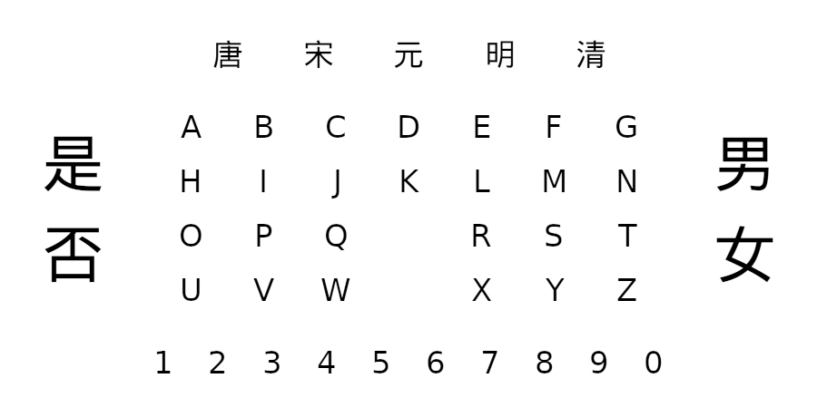

# 笔仙-Arduino
使用Arduino Uno来玩笔仙游戏，“纸”上的内容见下图：

因为使用LCD1602无法显示汉字，所以对汉字进行了替换：
* 是 - √
* 否 - x
* 男 - ♂
* 女 - ♀
* 唐 - t
* 宋 - s
* 元 - y
* 明 - m
* 清 - q

## 电子模块需求
* Arduino Uno
* 双轴按键摇杆
* LCD1602
* LCD1602转接板（可选，需要安装[LiquidCrystal I2C](https://www.arduino.cc/reference/en/libraries/liquidcrystal-i2c/)库）

## 接线
### 双轴按键摇杆
* GND - GND
* VCC - 5V
* VRX - A0
* VRY - A1

### LCD1602
##### 无转接板
* VSS - GND
* VDD - 5V
* V0  - 10
* RS  - 9
* RW  - GND
* E   - 8
* D4  - 4
* D5  - 5
* D6  - 6
* D7  - 7
* A   - 5V
* K   - GND

##### 有转接板
* SCL - SCL
* SDA - SDA
* VCC - 5V
* GND - GND

## 准备
1. 拆除摇杆模块的摇杆帽
2. 将笔固定在摇杆上（将笔尖插入到摇杆的孔中，如果摇杆没有孔，可使用胶带、胶水等工具固定）
3. 连接设备并烧录程序（无转接板烧录bixian.ino，有转接板烧录bixian_i2c.ino）
4. 找一个小伙伴
5. 等到晚上（最好0点到1点之间）
6. 找一个昏暗且安静的地方
7. 怀着尊敬笔仙的心情

## 玩法
1. 两人手背交错，手指相互交叉，将笔夹在手指间，保证手悬空且放松
2. 反复默念口诀（例如：笔仙笔仙，你是我的前生，我是你的后世，若要与我续缘，请在纸上画圈）
3. 如果LCD显示出字符，表示已经请来了笔仙（该过程所需时间因人而异，一定要诚心诚意）
4. 问笔仙一些简单的问题
5. 向笔仙告别（例如：笔仙，今天就到这里好吗）
6. 把笔折断
7. **把单片机、摇杆和LCD烧毁**
8. **把单片机、摇杆和LCD烧毁**
9. **把单片机、摇杆和LCD烧毁**

### 请神容易送神难，一定要:fire::fire::fire:
